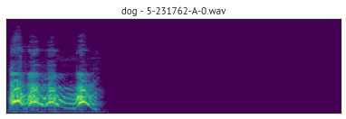
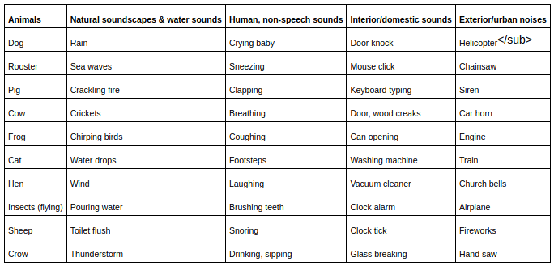

# Audio-Competition

> Small datasets to test novel audio algorithms, heavily influenced by [imagenette](https://github.com/fastai/imagenette)

## The Datasets

### ESC-50: Environmental Sound Classification

The ESC-50 dataset is a labeled collection of 2000 environmental audio recordings suitable for benchmarking methods of environmental sound classification.



The dataset consists of 5-second-long recordings organized into 50 semantical classes (with 40 examples per class) loosely arranged into 5 major categories:



ESC-50 is a really nice starting dataset as it is especially clean (fixed-length, hand-labeled, single sample-rate) and well maintained. Many thanks to [Karol Piczak](https://github.com/karoldvl) for maintaining a really great [Github Repo](https://github.com/karolpiczak/ESC-50) based around this dataset.


## Usage

If you are already using the [fastaudio library](https://fastaudio.github.io/), you can _download and access_ these quickly with commands like:

```python
path = untar_data(URLs.ESC50)
```

where `path` now stores the destination to ESC-50.  


## Leaderboard

Generally you'll see +/- 1% differences from run to run since it's quite a small validation set. So please only send in contributions that are higher than the reported accuracy >80% of the time. Here's the rules:

- No inference time tricks, e.g. no: TTA
- Must be one of the split/#epoch combinations listed in the table
- If you have the resources to do so, try to get an average of 5 runs, to get a stable comparison. Use the "# Runs" column to include this
- In the URL column include a link to a notebook, blog post, gist, or similar which explains what you did to get your result, and includes the code you used (or a link to it), including the exact commit, so that others can reproduce your result.

### ESC-50 Fold 1 Leaderboard

- For this leaderbord, use only the data corresponding to Fold 1 to validate, and train on the other 4 folds.

| Epochs | URL | Accuracy | # Runs |
|--|--|--|--|
|80|[fastaudio baseline w/ mixup](https://github.com/fastaudio/Audio-Competition/blob/master/ESC-50-baseline-1Fold.ipynb)|78.25%|1|
|20|[fastaudio baseline](https://github.com/fastaudio/Audio-Competition/blob/master/ESC-50-baseline-1Fold.ipynb)|66.64%|5, mean|
|10|[fastaudio baseline](https://github.com/fastaudio/Audio-Competition/blob/master/ESC-50-baseline-1Fold.ipynb)|62.69%|5, mean|


### ESC-50 All Folds Leaderboard

- For this leaderbord, do 5-fold cross validation using the splits defined in the metadata, and report the mean accuracy.

- The results here are also comparable with the [official dataset leaderbods](https://github.com/karolpiczak/ESC-50#results)

| Epochs | URL | Accuracy | # Runs |
|--|--|--|--|
|80|no entries yet|--|--|
|20|[fastaudio baseline](https://github.com/fastaudio/Audio-Competition/blob/master/ESC-50-baseline-AllFolds.ipynb)|67.35%|1|
|10|[fastaudio baseline](https://github.com/fastaudio/Audio-Competition/blob/master/ESC-50-baseline-AllFolds.ipynb)|64.94%|1|